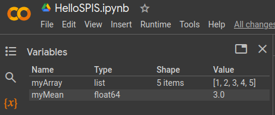
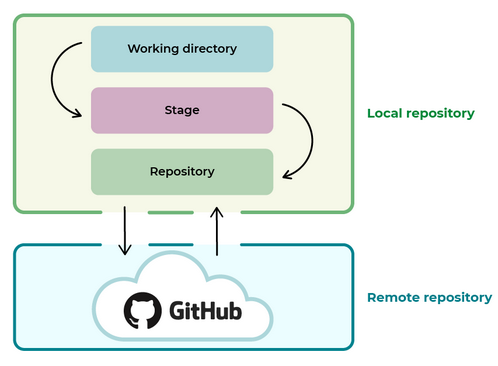
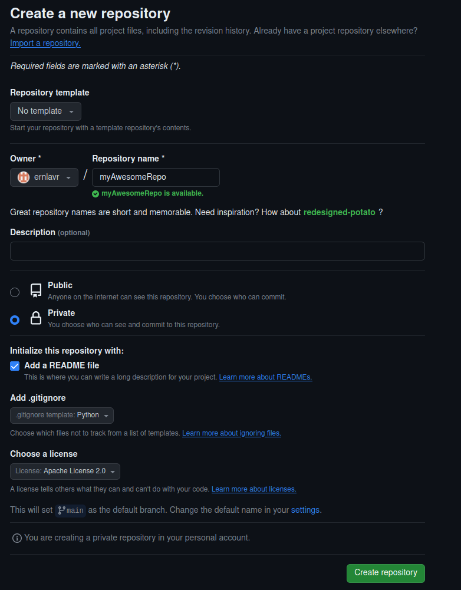
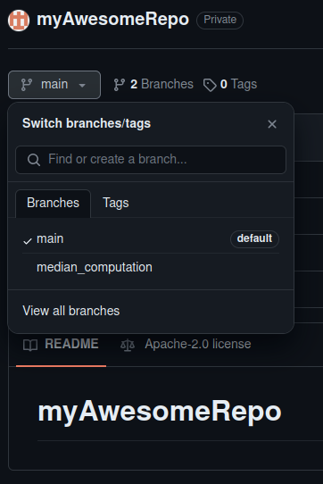

# Introduction

This handout is intended to help you navigate and kick-off your Python
development journey by using modern workflows. It is oriented towards
beginners; advanced students may skip some parts, but use this handout as a cheat-sheet or a
refresher!

## List of learning outcomes

1.  Familiarization with Google Collab 

2.  Learning basics of Git (most popular commands) and understanding the
    core workflow (local-remote repository)

3.  Using Google Collab with Git

4.  Modern Python development workflows (virtual environments)

5.  Development tools (VSCode, GitHub Copilot)

# Google Collab

Google Collab[^1] is a browser-based Python notebook[^2] programming
environment, meaning that you can execute Python code and write
*Markdown* format text in a *cell-based* environment[^3]. The easiest
way of using Collab is by having a Google account and saving your
*notebook (.ipynb)* files on your Google Drive, although later we'll see
that this is not the most optimal way of working.

The code is executed on Google's cloud hardware, this has an added
benefit of giving you limited but free available GPU resources. As of
writing this handout, the code is executed with Python 3.10.

## Example Notebook

Open the attached *HelloSPIS.ipynb* notebook in Collab and go through the following steps.

1.  Open Collab and upload the notebook. *File → Open Notebook → Upload*.

2.  Execute each cell with *Ctrl + Shift*

3.  Execute all cells *Runtime → Run All (Ctrl + F9)*

4.  Enable free GPU acceleration. *Runtime → Change Runtime Type → Select your Hardware Acceleration (T4)*. Useful for any GPU acceleration base applications, e.g. machine learning.

5.  Insert a new *code* cell. Click where you want to insert it and *Ctrl + M + B*

6.  Observe your current variable states. See Figure [1](#fig:state)

# Git and GitHub {#sect:git}

**Git** is a code version control system developed by Linus Torvalds
(maker of Linux kernel). It essentially allows you to manage your code
into specific snapshots, create a development history and collaborate
with other developers.

**GitHub**, on the other hand, is a product owned by Microsoft that
wraps some of the Git functionality with a nice user interface, provides
storage space for countless code repositories and integrates other
useful *DevOps* features.

So for this part, please install Git[^4] locally on your computer
(default settings will work just fine!) and create a GitHub account[^5].
Git is an industry-standard tool and there are good reasons why everyone
uses it, if you are serious about programming then you should get
comfortable with it throughout your time in university.

## One Bit of Theory

A benefit of Git is its decentralized way of working. This means that
every time you *clone* a Git repository, you capture a snapshot from a
*remote* server (e.g. GitHub). This creates a *local* repository on your
computer where you do your code development. As you make changes in your
*working directory*, you will end-up creating snapshots called
*commits*. These *commits* are saved to the *local repository* to form a
history that can be used as progress reports, documentation and history
to which also present states of the codebase can also be reverted to.
Finally, once you are ready to publish your changes, you *push* them to
the remote repository.

Git is a very powerful and complex tool with many advanced features,
although as an individual developer or a collaborator within a small
group (e.g. university project group), about 95% of your time you will
end up using just a small subset of its features. Although the best way
to learn Git is by using it, it could be beneficial for you to read-up
on the commands in Figure [3](#fig:gitCheatSheet). 
Otherwise, feel free to look up any
other cheat sheets just by Google searching for them!

## Using SSH keys within Git

SSH is used for security within an internet environment. For GitHub to
know that the person pushing the changes is really you, it needs to use
SSH keys as a form of identification. Creating and adding them to your
account should be straight forward, just follow this[^6] guide for
creating a key, and this[^7] guide for connecting your key to your
account. If you encounter issues, just remember that Google is your best
friend!

## Your First Repository and Commit

When navigating Git, we recommend getting used-to using the command
terminal, eventually you will find it more straight forward to use than
UI based applications. There are multiple reasons why using the terminal
is beneficial, among which is the simplicity of executing a text-based
command. If you ever will need to get help, or help others, text-based
commands will be the most straight-forward and easiest way to
communicate and accept the information.

That being said, fire up your terminal! Upon successful Git
installation, on Mac and Linux, you should have Git added to your
standard terminal. On Windows you would need to *Right-Click*[^8] in a
folder and click *Git Bash here*.

1.  Open GitHub website on your browser and click the *New* button to
    create a new repository, see Figure
    [4](#fig:gitRepo)

2.  Go through the steps of creating a new repository. The important
    part is to add a relevant *.gitignore* template and decide if you
    want the repository *public* or *private*, the rest is up to you.
    See Figure [5](#fig:gitRepoSettings)

3.  Your browser should automatically navigate you to your new
    repository. Click the green *Code* button and copy the link from the
    SSH tab.

4.  Navigate to your Git terminal and issues *'git clone YOUR_LINK'*
    command

5.  This now should download the repository on your computers. Take the
    *HelloSPIS.ipynb* file from the Section
    [2](#sect:gcollab) and copy it in the newly created directory.
	*Note:* You can navigate the terminal environment with *cd myAwesomeRepo* to enter your repository (or any other folder), use *ls* to view the contents, use *cd ..* to go one folder up.

6.  Issue *cd myAwesomeRepo* to enter the repository in the terminal
    environment and issues *git status*. You should see that you have an
    *untracked file*. This means that this file is completely new to
    your repository.

7.  Add your file to *staging*. Issue the command *git add
    HelloSPIS.ipynb*. Note: to speed up your work, you can press *TAB*
    key to autocomplete partially written file names, i.e. *git add
    Hel* + TAB should autocomplete the file name. This works only if the
    file name can be resolved to a single file.

8.  Make a *commit* to your *local* repository. Issue the command *git
    commit -m \"add helloSPIS\"*. It is good practice to use short and
    explicit messages, this will be useful if you ever need to review
    the history!

9.  Now *push* your file to GitHub. Issue the command *git push*, you
    may be prompted for a password. Once this is complete, go back to
    GitHub and notice how your file is added to the remote server!

10. Optional: Make a code edit to the file and repeat through steps 6-9,
    you can also use *git diff* to see your performed changes.

## Git Development Branches

One of the most common features used during development is *branching*.
This essentially means that you divert your future *commits* to a
separate environment within Git called a *branch*. In practice, this
isolates your *state-of-the-art* codebase (main branch) from your
*prototyping* codebase (development branch). This feature is critical
because you do not want to potentially break or pollute your most
recent, working codebase with experimental code that may not be fully
tested or developed. Let's take a look at this feature!

1.  Open your Git terminal and issue *git checkout -b
    \"median_computation\"*. In the next section, you will add a simple
    one line of code for computing the median.

2.  Issue the command *git push --set-upstream origin
    median_computation*. This will do two things at once, push the newly
    created branch to the remote repository and set it as an upstream
    branch, meaning that all future commits will be pushed to it. Note:
    You can use *git branch*, *git branch --remote* and *git checkout
    BRANCH_NAME* to view local, remote branches and switch to a new
    branch.

3.  Take a look at your repository on GitHub website. You can expand the
    branch dropdown and should see your newly created branch there. See
    Figure [6](#fig:gitBranch).

# Google Collab and Git

In Section [2](#sect:gcollab) we were developing code right within our
Google Drive. While it works for quick checks, generally this is an
awful way of working because you end up with scattered files and a poor
development history. In this segment, we will read a notebook directly
from a Git repository and save changes back into Git.

1.  Navigate back to Google Collab and hit *File → Open Notebook →
    GitHub Tab*. Enter your Git username, depending on if you made your
    repository *private* during Section
    [3](#sect:git), you need
    to enable *private repositories* and a pop-up should appear for
    authentication. See Figure
    [7](#fig:gitInCollab)

2.  You should see your Notebook file become available. Make sure to
    select the correct branch and open the file.

3.  Make a change to the codebase, e.g. compute the median with
    *np.median()* function and print out the value.

4.  Navigate to *File → Save as Copy to GitHub*, select the
    ***median_computation* branch** that was created in Section
    [3.4](#subsect:gitDevBranch), enter a relevant commit message
    and hit OK! See Figure
    [8](#fig:gitInCollab_commit).

5.  Open up GitHub website and notice that a new change has been added
    to the file! Note: make sure you're viewing the correct branch.

6.  *Many Bonus Points:* Navigate back to your repository within your
    Git terminal and issue *git pull* command to pull now the latest
    changes from the GitHub website. Congrats!!

# Python, VSCode and Virtual Environments

## Virtual Environments

Throughout your Python development journey, you will end up working on
multiple different projects that have their own unique demands and
external dependencies (Python packages). While one-time simple
prototyping may get you away with using standard Python and its *pip*
package manager, a more robust and industry-standard workflow is by
using virtual environments. Virtual environments is a way to isolate
your Python package installations into separate, independent *boxes*.
This can help you avoid dependency collisions in cases where different
packages may require different versions of sub-packages, while you may
not experience this is you use most mainstream packages such as
*Matplotlib, Pandas, Numpy*, if you end up running either experimental
legacy code, or using something more exotic, there may be requirements
for particular versions. This is where **Conda** comes into play.

**Conda** is a virtual environment tool that has a multitude of
different flavours such as *Anaconda, Miniconda, Miniforge* and possibly
others. The core functionality of it is the same, they just come with
different preset configurations. When you install Python packages,
*Conda* will automatically solve (cross-check) the package versions to
prevent collisions and refuse to install if there is a risk of breaking
your environment. Besides isolating your Python environments, *Conda* is
also highly beneficial for managing your Python versions. Want to use
Python 3.10, 3.9 or 3.12? No problem! Just specify your Python version
as a parameter upon creation of your environment!

### Miniconda and Mamba

To start off, please use this[^9] guide to install your Miniconda
environment. Default settings will work just fine. Afterwards, if you
use Mac or Linux, your Conda environment should be accessible via your
standard terminal. If on Windows, search for *Miniconda prompt* within
your search bar. Type *conda --version* in the terminal to cross-check
that it has installed correctly. If all looks good, then continue on
with the handout, otherwise try Googling and troubleshooting your
problem.

Note: If you see a message *Conda command not found* after installation.
Try this guide [^10]. Dont forget to swap out all *anaconda* related
things with *miniconda*.

### Conda Base

You can activate Conda by typing *conda activate*. Your terminal should afterward contain the *base*, see Figure [9](#fig:condaAct). *Base* is your parent environment from which all further environments will be *branched* off from. **Do not install packages in your base environment!** Base environment should be kept clean and minimal because your development environments will be based off it, there are very rare cases when you should install packages in your base environment, one of which is covered in the next section.

### Mamba

Mamba is a C++ ported implementation of Conda which means that it is **a
lot** faster than Miniconda. Additionally, it has an implementation for
package caching, so you end up saving space on your computer.

Mamba can be installed in your *Base* environment because then you will
be able to use it throughout your development environments, it can be
seen as an extension of Conda. This[^11] is your standard repository for
Conda packages, issue the command *conda install conda-forge::mamba* to
install it. **From now on, replace all future *conda XXX* commands with
*mamba XXX***.

### Your first environment

Use the supplementary *environment.yml* file to create the predefined
development environment. For any further commands, consult online cheat
sheets[^12]! Remember that you can replace *conda* prefix with *mamba*
to use the C++ acceleration.

1.  Use the command *mamba env create -f environment.yml*. Note that you
    need to navigate to the folder that contains your *environment.yml*
    file. Use *cd* and *ls* (*dir* for Windows) commands to your help!

2.  Activate the environment with *mamba activate helloSpis*. The *base*
    should now change to your environment name, see Figure
    [10](#fig:condaActEnv).

3.  Activate your Python interpreter via Conda by typing *python3* (or
    *python* on Windows). You should see **Python version 3.10**.

4.  Import Numpy as a validation step. Type *import numpy*. If you see
    an error, then you've made a mistake in one of the steps above.

**Optional:** Here are steps for creating an environment from scratch.

1.  Ensure you have **base** environment activated! Type *mamba
    deactivate* to exit your development environment

2.  Create an environment with *mamba create --name myEnvironment
    python=3.10*. *Note*: The Python version specification is optional,
    you can leave that out to use the latest Python or change it to a
    different version.

3.  Activate your environment *mamba activate myEnvironment*

4.  Install any packages you'd like. Try searching and installing Numpy
    from here https://anaconda.org/ the installation command will be
    accompanied in the package page.

## Python Development and VSCode

Fundamentally, it is up to you what text editor you use and how you set
up your development environment. Many bloggers will have trivial
conversations over *what code editor to use* and *which code editor is
the best*. We recommend VSCode because of it high flexibility, usability
and integrations of useful development plugins. In this section we will
link up your Python virtual environment with VSCode and execute your
favorite Jupyter Notebook *helloSpis.ipynb*.

1.  Download and install VSCode [^13]. Default settings will work just
    fine!

2.  Open up VSCode and navigate to *Extensions* tab. See Figure
    [11](#fig:vsCodeExtn).

3.  Install the following extensions: *Python, Python Debugger, Jupyter*

4.  Open the *HelloSPIS.ipynb* notebook and comment-out the *pip*
    package installation command from the first cell, and select your
    *helloSpis* Conda environment (see top-right corner of Figure
    [12](#fig:jupyterInVscode)). The notebook should look similar
    as in Figure [12](#fig:jupyterInVscode)}. 

5.  Execute the notebook by pressing *Run All*. Additionally, you can
    execute also cell-by-cell with *Shift+Enter*.

Does your virtual environment not automatically show-up in VS-Code? Try
these steps to point to it manually.

1.  Open your command-pallette (Ctrl + shift + P) and locate *Python:
    select interpreter*.

2.  Locate your virtual environment, Python3 binary. On Unix (Mac/Linux)
    it should be in
    */home/USER_NAME/miniconda3/envs/helloSpis/bin/python3*

3.  On Windows
    *C:/Users/username/Miniconda3/envs/helloSpis/bin/python.exe*

4.  Select it and try rerunning the code. If this does not work, use
    Google to troubleshoot.

## Optional: GitHub Copilot

Github copilot is an aid for programmers that provides you with code
suggestions based on context and comments. It essentially acts as a
clever *auto-fill*. While we do not prevent you from using it, if you
are a beginner programmer it will be beneficial for you to write-out
code yourself and learn to solve, troubleshoot and debug manually,
purely for learning purposes. Nevertheless, Copilot is a great tool and
independent of your experience, you should be aware of it.

See an installation and introduction guide here[^14]. On VS-Code you'll
need to install the Copilot extension.

Happy coding! :-)

[^1]: https://colab.research.google.com/

[^2]: Some of you may know this workflow format as \"Jupyter Notebook\"

[^3]: Meaning that code is structured into chunks and executed
    chunk-by-chunk

[^4]: https://git-scm.com/

[^5]: https://github.com/

[^6]: https://docs.github.com/en/authentication/connecting-to-github-with-ssh/generating-a-new-ssh-key-and-adding-it-to-the-ssh-agent?platform=windows

[^7]: https://docs.github.com/en/authentication/connecting-to-github-with-ssh/adding-a-new-ssh-key-to-your-github-account

[^8]: On Windows 11 you may need to expand further to *Show More
    Options*

[^9]: https://docs.anaconda.com/free/miniconda/

[^10]: https://saturncloud.io/blog/solving-the-conda-command-not-found-issue-after-installing-anaconda3/

[^11]: https://anaconda.org/conda-forge/mamba

[^12]: https://docs.conda.io/projects/conda/en/4.6.0/\_downloads/52a95608c49671267e40c689e0bc00ca/conda-cheatsheet.pdf

[^13]: https://code.visualstudio.com/

[^14]: https://github.com/features/copilot
