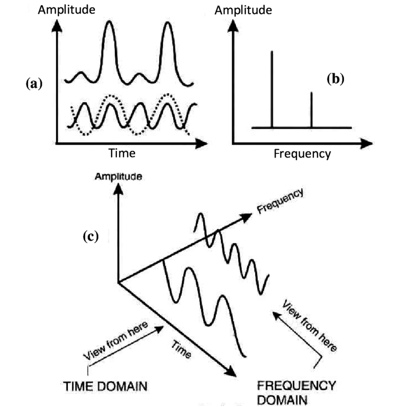

Signal Processing for Interactive Systems
=========================================

Cumhur Erkut, Anders Bargum, and Mubarik Jamal Muuse

With previous material from Jesper R Jensen, Ernests Lavrinovits, and Jesper K Nielsen.

A graduate course in Aalborg University Medialogy and Sound & Music Computing programs.

Modern multimedia systems often make use of numerous sensors to capture inputs from the user(s) for interaction with the system.
However, the real-life environment around such systems is typically dynamic, noisy, and unpredictable.
This hinders direct application of data-driven methods to infer the desired user interaction.

This course introduces signal processing theory and methods for analyzing and processing sensor data, e.g., to facilitate robust feature extraction and data clean-up for subsequent machine learning. The following topics provide the basis of our exploration.

1. **Spectral Analysis**: Examining the frequency content of signals.
   Techniques like the Fourier Transform or Short-Time Fourier Transform help reveal the underlying frequencies in a signal.
2. **Signal Modeling**: Signal models describe how real-world signals behave.
   Examples include harmonic summation and  sinusoidal models.
3. **Parameter Estimation**: We often need to estimate unknown signal or model parameters from observed data.
   Methods like Maximum Likelihood Estimation (MLE) or Least Squares Estimation (LSE) come into play here.
4. **Signal Enhancement**: Enhancing signals involves improving their quality by reducing noise, sharpening edges, or enhancing specific features. Adaptive filters, wavelet denoising, and Wiener filtering are commonly used techniques.

# APROACH

Time-frequency signal analysis/synthesis suitable for machine / deep learning tasks.

Mathematical theory: postponed to PhD level:
- https://www.numerical-tours.com
- https://mathematical-tours.github.io

# CONTENT

* [00-Course-intro](https://smc-aau-cph.github.io/SPIS/00-Course-intro/README.html), [01-Intro-librosa](https://smc-aau-cph.github.io/SPIS/01-Intro-librosa/librosa-101.html), and [./02-Compute](https://smc-aau-cph.github.io/SPIS/02-Compute)
* [./03-Fourier-Transform](https://smc-aau-cph.github.io/SPIS/03-Fourier-Transform/SPIS03.html)
* [./04-Spectral-Chromogram-Motiongram](./04-Spectral-Chromogram-Motiongram/MusicalGesturesToolbox.ipynb)
* [.~~/05-FAST-NLS-F0~~](./05-FAST-NLS-F0/)➡️ Image & Custom Blocks, Physiological Signals (HRV, EEG)
* [./06-Pitch-Basics](./06-Pitch-Basics/SPIS-06-PitchBasics.ipynb)
* [./07-Torch](https://smc-aau-cph.github.io/SPIS/07-Torch/README.html)
* [./08-Workshop](https://smc-aau-cph.github.io/SPIS/08-Workshop/README.html)
* [./Appendix-1: More Torch](./A1-Torch/TorchLossViz.ipynb)
